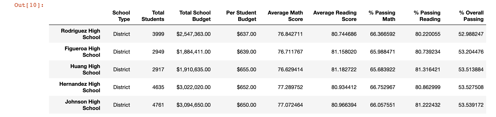

# Pandas Challenge

# PyCitySchools

In this project, we've been asked to analyze the district-wide standardized test results. We will be given access to every student's math and reading scores, as well as various information on the schools they attend. Our responsibility is to aggregate the data and showcase obvious trends in school performance.

The final report should include each of the following:

# District Summary

Create a high level snapshot (in table form) of the district's key metrics, including:

- Total Schools
- Total Students
- Total Budget
- Average Math Score
- Average Reading Score
- % Passing Math (The percentage of students that passed math.)
- % Passing Reading (The percentage of students that passed reading.)
- % Overall Passing (The percentage of students that passed math and reading.)

 

 

# School Summary

Create an overview table that summarizes key metrics about each school, including:

- School Name
- School Type
- Total Students
- Total School Budget
- Per Student Budget
- Average Math Score
- Average Reading Score
- % Passing Math (The percentage of students that passed math.)
- % Passing Reading (The percentage of students that passed reading.)
- % Overall Passing (The percentage of students that passed math and reading.)

 

 

# Top Performing Schools (By % Overall Passing)

Create a table that highlights the top 5 performing schools based on % Overall Passing. Include:

- School Name
- School Type
- Total Students
- Total School Budget
- Per Student Budget
- Average Math Score
- Average Reading Score
- % Passing Math (The percentage of students that passed math.)
- % Passing Reading (The percentage of students that passed reading.)
- % Overall Passing (The percentage of students that passed math and reading.)

 

 

# Bottom Performing Schools (By % Overall Passing)

Create a table that highlights the bottom 5 performing schools based on % Overall Passing. Include all of the same metrics as above.

 

 

# Math Scores by Grade

Create a table that lists the average Math Score for students of each grade level (9th, 10th, 11th, 12th) at each school.

 

 

# Reading Scores by Grade

Create a table that lists the average Reading Score for students of each grade level (9th, 10th, 11th, 12th) at each school.

 

 

# Scores by School Spending

Create a table that breaks down school performances based on average Spending Ranges (Per Student). Use 4 reasonable bins to group school spending. Include in the table each of the following:

- Average Math Score
- Average Reading Score
- % Passing Math (The percentage of students that passed math.)
- % Passing Reading (The percentage of students that passed reading.)
- % Overall Passing (The percentage of students that passed math and reading.)

 

 

# Scores by School Size

Repeat the above breakdown, but this time group schools based on a reasonable approximation of school size (Small, Medium, Large).

 

 

# Scores by School Type

Repeat the above breakdown, but this time group schools based on school type (Charter vs. District).

 

 

# Observable Trends:

 * **District Summary:** The students are good in reading with respect to Math. More than 65% of the total students have passed in both the subjects.

* **Top performing school:** The Charter school type are in the top performing schools. The overall passing percentage is greater than 90% and have less number of students with respect to the District model.

* **Bottom performing school:** District school types are bottom performer with overall passing percentage less than 55%. It is also observable that they have higher number of students with respect to the Charter school types.

* **Math scores by grade:** Out of 15 schools, only 8 has more than 80% average math score for students of each grade level (9th, 10th, 11th and 12th) and all are of Charter Model.

* **Reading scores by grade:** All schools have more than 80% average reading score for students of each grade level (9th, 10th, 11th and 12th. It seems that students of both type of schools are doing good in reading.

* **Scores by School Spending:** When the budget per student is less, then the overall passing percent increases. In other words we can say that the budget per student is inversely proportional to the overall passing percentage.

* **Scores by School size:** The schools where number of students are less than 2000 are doing good in all respect. Whereas the schools having more number of students are doing good in Reading only but the overall passing percentage is less than 60%.

* **Scores by School Type:** The Charter model of schools have good overall passing percentage including Math and Reading. On contrary, the district model of schools are good only in reading but have less than 60% of overall passing.
